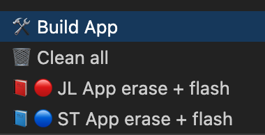

# STM32 Gesture Recognition Repository

## Overview

This repository contains the firmware for the STM32F103RB Nucleo Board used in the gesture recognition system. The board is responsible for acquiring data from four EMG sensors and one MPU6050 inertial sensor, and transmitting this data via UART.

## Data Acquisition

- **Sampling Rate**: The STM32 polls data at a rate of **1 kHz**.
- **EMG Sensors**: Four channels are read through the ADC.
- **MPU6050**: This sensor is interfaced via I2C.

### Data Format

Data is transmitted over UART in the following format, with 5 values sent for each channel during each transmission:

```
EMG0:4012,4014,4016,4018,4019
EMG1:3143,3132,3122,3111,3100
EMG2:693,678,664,650,636
EMG3:194,205,217,228,240
ACCX:3967,3969,3971,3972,3974
GYRX:960,961,962,962,963
ACCY:3118,3108,3097,3086,3075
GYRY:535,530,525,519,514
ACCZ:724,710,696,682,668
```

## Command System

The firmware includes a simple command system to control data acquisition via UART:

- **`r`**: Starts data acquisition (run) and begins sending data.
- **`s`**: Stops data acquisition (stop).
- **`p`**: Sends a ping command.

### Ping Response

Upon receiving the ping command, the response is:

```
EMG sensors here\r\n
```

## Hardware Configuration and pinout

- **Board**: STM32F103RB Nucleo Board

### UART Configuration

- **USART2**
- **TX pin**: PA2
- **RX pin**: PA3
- **Baud Rate**: 2Mbps.

### I2C

- **I2C1**
- **SDA pin**: PB9
- **SCL pin**: PB8
- **Speed**: Fast mode 400kHz.

### ADC

- **ADC1**
- **Channels and pins**:

    | ADC Channel | Pin   |
    |-------------|-------|
    | ADC1_IN0   | PA0   |
    | ADC1_IN1   | PA1   |
    | ADC1_IN4   | PA4   |
    | ADC1_IN8   | PB0   |


## Build and flash:

To build and flash STM32 project, open project in VSCode and open tasks menu with hotkeys:

***Windows/Linux:***

<kbd>Ctrl</kbd>+<kbd>Shift</kbd>+<kbd>B</kbd>

***MacOS:***

<kbd>Cmd</kbd>+<kbd>Shift</kbd>+<kbd>B</kbd>

**Tasks menu:**



*JL - JLink*

*ST - STLink*

## Major project

This repository serves as a submodule of the larger project: [EMG Gesture Recognition](https://github.com/nktsb/EMG_gesture_recognition).


